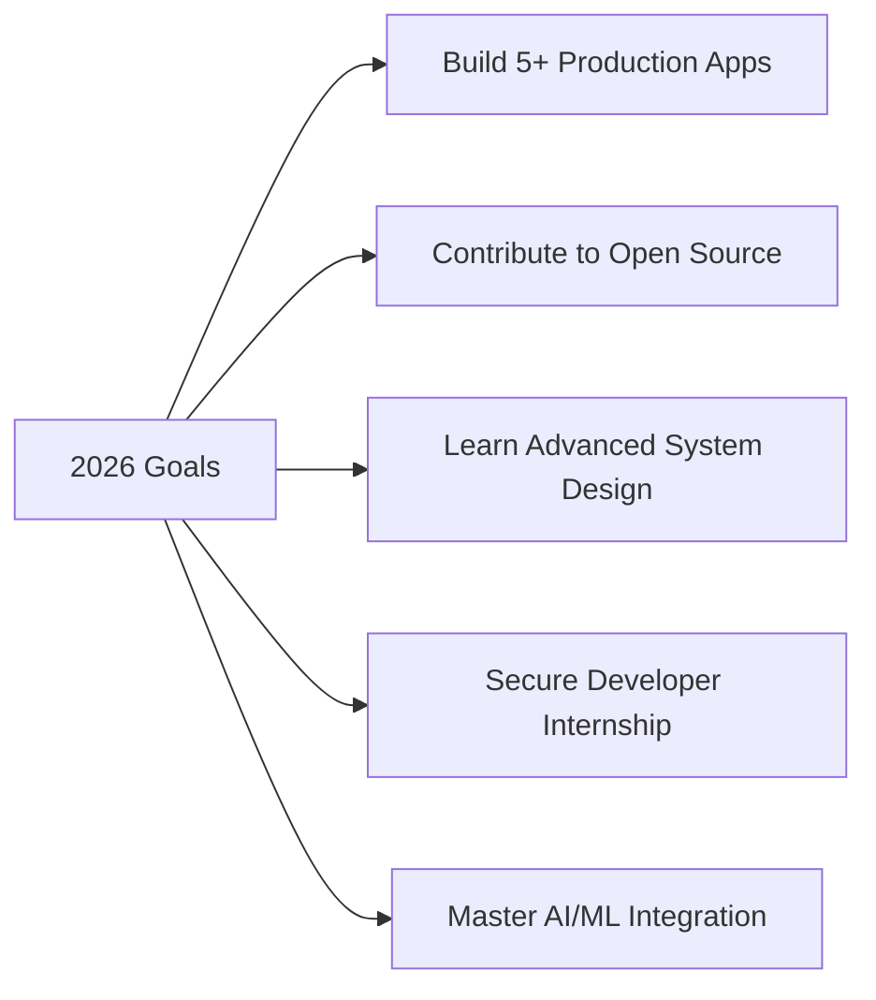

<div align="center">

# 👋 Hi, I'm Khushant Sharma

### 🚀 Full Stack Developer | AI/ML Enthusiast | Problem Solver

<p align="center">
  <a href="https://www.linkedin.com/in/khushant-sharma-9318962b2"></a>
  <a href="mailto:khushantsharma766@gmail.com"></a>
  <a href="https://github.com/Khushant15"></a>
</p>


</div>

---

## 🧑‍💻 About Me

```typescript
const khushant = {
  pronouns: "he/him",
  location: "India 🇮🇳",
  education: "Computer Science Undergrad",
  focus: ["Full Stack Development", "AI/ML", "System Design"],
  currentlyLearning: ["Advanced React Patterns", "LLM Integration", "Cloud Architecture"],
  funFact: "I love debugging more than writing code! 🐛",
  philosophy: "Learn by building, build to learn"
};
```

I'm passionate about creating **intelligent, scalable applications** that solve real-world problems. From building AI-powered coding assistants to smart learning platforms, I enjoy turning complex ideas into functional products.

💡 **What drives me:**
- Creating impactful products that users love
- Understanding systems from the ground up
- Exploring cutting-edge AI/ML technologies
- Contributing to open-source communities

---

---

## 🚀 Featured Projects

<table>
<tr>
<td width="50%">

### 🤖 [CodeBuddy](https://github.com/Khushant15/CodeBuddy)
**AI-Powered Debugging & Coding Ecosystem**
An intelligent platform designed to streamline developer workflows by integrating real-time execution with AI-assisted debugging and code optimization.
**Tech:** React, Node.js, Firebase, Gemini/Claude APIs

</td>
<td width="50%">

### 💼 [CareerSync-AI](https://github.com/Khushant15/CareerSync-AI)
**AI-Driven Career Optimization Suite**
An advanced system for synchronizing career goals with industry demands, leveraging AI to analyze resumes, track applications, and provide market-aligned insights.
**Tech:** Next.js, OpenAI API, Tailwind CSS, PostgreSQL

</td>
</tr>

<tr>
<td width="50%">

### 📚 [PrepBuddy](https://github.com/Khushant15/PrepBuddy)
**Adaptive Learning & Interview Readiness**
A comprehensive full-stack solution for automated interview preparation, featuring AI mock interviews, technical assessment logic, and progress tracking.
**Tech:** Next.js (App Router), PostgreSQL, Tailwind CSS

</td>
<td width="50%">

### 🛡️ [CodeShield](https://github.com/Khushant15/CodeShield)
**Static Analysis & Security Tooling**
A security-focused project designed to identify critical vulnerabilities like SQL injection and XSS in user-submitted code snippets before deployment.
**Tech:** TypeScript, Python, Security Heuristics

</td>
</tr>
</table>

---

## 🛠️ Tech Stack & Tools

<details open>
<summary><b>💻 Languages</b></summary>
<br>
<p>
  
  
  
  
  
  
  
</p>
</details>

<details open>
<summary><b>⚛️ Frontend</b></summary>
<br>
<p>
  
  
  
  
  
</p>
</details>

<details open>
<summary><b>⚙️ Backend</b></summary>
<br>
<p>
  
  
  
  
  
</p>
</details>

<details open>
<summary><b>🤖 AI/ML & LLMs</b></summary>
<br>
<p>
  
  
  
  
</p>
</details>

<details open>
<summary><b>☁️ Cloud & DevOps</b></summary>
<br>
<p>
  
  
  
</p>
</details>

<details open>
<summary><b>🔧 Tools & IDEs</b></summary>
<br>
<p>
  
  
  
</p>
</details>

---

## 📊 GitHub Analytics

<div align="center">
  
  
</div>

<div align="center">
  
</div>

<div align="center">
  
</div>

---

## 🏆 Achievements & Highlights

- 🚀 Built **CodeBuddy** - AI-powered coding assistant with 100+ users
- 📚 Developed **PrepBuddy** - helping students prepare smarter
- 💻 Active contributor to personal and open-source projects
- 🎯 Solved 200+ coding problems across multiple platforms
- 🌟 Continuously learning and implementing cutting-edge technologies

---

## 🎯 2026 Goals



- 🚀 Launch 5+ production-ready applications
- 💼 Secure a strong developer internship at a product company
- 🌍 Make meaningful contributions to open-source projects
- 📦 Build and deploy AI-powered SaaS platforms
- 🎓 Master advanced system design and architecture patterns
- 🤖 Deepen expertise in LLM integration and AI applications

---

## 💡 Currently Working On

```javascript
const currentFocus = {
  project: "AI Chrome Extension for Coding Problems",
  learning: ["Advanced React Patterns", "System Design", "LLM APIs"],
  reading: "Designing Data-Intensive Applications",
  nextUp: "Building a Full-Stack AI SaaS Platform"
};
```

---

## 📈 Contribution Graph


<div align="center">


</div>
---
## 📫 Let's Connect!

<div align="center">

I'm always open to interesting conversations and collaboration opportunities!

[](https://www.linkedin.com/in/khushant-sharma-9318962b2)
[](mailto:khushantsharma766@gmail.com)
[](https://khushant-portfolio.vercel.app/)


</div>

---

<div align="center">

### 💭 Quote of the Day


---

**⭐ From [Khushant15](https://github.com/Khushant15) - Building the future, one commit at a time!**

</div>
